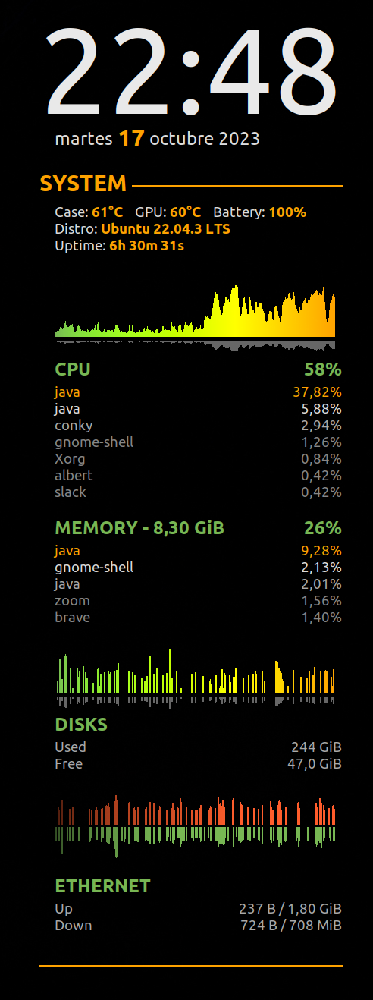

# CAAY Shadow Info Conky Mod

Simple Conky mod for system monitoring (without lua scripts)

Based on *conkyrc_seamod* and *gotham* mod

## Example

## Install

`git clone https://github.com/caay2000/caay-shadowinfo-conky-mod`

`mv caay-shadowinfo-conky-mod $HOME/.conky`

## Customization

You can check this http://www.ifxgroup.net/conky.htm in order to udnerstand how to modify this mod 