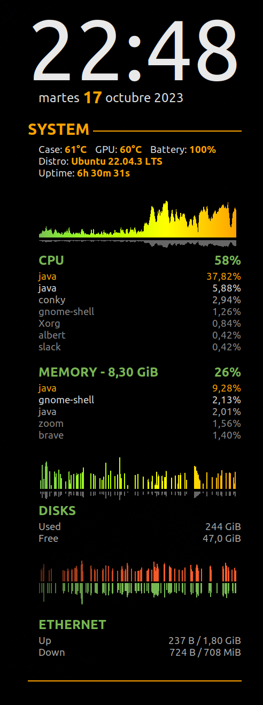
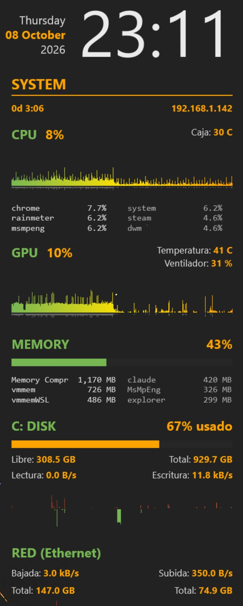

# CAAY Shadow Info Conky Mod

Simple system monitor for the desktop, in two flavours:

- **Linux**: the original [Conky](https://github.com/brndnmtthws/conky) mod (without lua scripts) — folder [`conky`](conky)
- **Windows**: a [Rainmeter](https://www.rainmeter.net/) port of the same look — folder [`rainmeter`](rainmeter)

Based on *conkyrc_seamod* and *gotham* mod

## Conky (Linux)

### Install

`git clone https://github.com/caay2000/caay-shadowinfo-conky-mod`

`mkdir -p $HOME/.conky && cp caay-shadowinfo-conky-mod/conky/shadowinfo $HOME/.conky/`

`conky -c $HOME/.conky/shadowinfo`

### Customization

You can check this http://www.ifxgroup.net/conky.htm in order to understand how to modify this mod

## Rainmeter (Windows)

### What it shows

- Clock, date, uptime and local IP
- **CPU**: usage %, CPU and case temperature, gradient usage graph with shadow and top 6 processes
- **GPU** (NVIDIA): usage %, temperature, fan speed (%) and gradient usage graph with shadow
- **Memory**: usage %, bar and top 6 processes
- **Disk**: used %, free / total space, read / write speed and mirrored graphs
- **Network**: download / upload speed, totals and mirrored graphs

### Requirements

- [Rainmeter](https://www.rainmeter.net/). No extra plugins needed: everything used ships with it.
- NVIDIA drivers, for the GPU block (it reads the data from `nvidia-smi`).
- *Optional:* [Core Temp](https://www.alcpu.com/CoreTemp/) running in the background, for the CPU temperature.
  Windows does not expose the real CPU temperature by itself; while Core Temp is not running that line is simply hidden.

### Install

1. Create the folder `Documents\Rainmeter\Skins\ShadowInfo`
2. Copy `rainmeter/ShadowInfo.ini` into it
3. In Rainmeter: *Manage* → *Refresh all* → select `ShadowInfo.ini` → *Load*

### Customization

Edit the `[Variables]` section at the top of `ShadowInfo.ini` and refresh the skin:

| Variable | Default | Description |
| --- | --- | --- |
| `NetInterface` | `Ethernet` | Name of the network adapter to monitor (e.g. `Wi-Fi`) |
| `Drive` | `C:` | Disk to monitor |
| `DateRightEdge` | `200` | Right edge (px) where the date block is aligned |
| `GPUTempAlarm` | `85` | GPU temperature (°C) that triggers the alarm |
| `AlarmColor` | `255,60,60` | Color used while the alarm is active |
| `GraphGradient` | green → yellow → orange | Gradient that fills the CPU and GPU graphs |
| `GraphShadowColor` | `102,102,102` | Color of the mirrored "shadow" under those graphs |
| `GraphShadowH` | `14` | Height (px) of that shadow |
| `GraphUpGradient` | dark red → red | Gradient of the upper disk / network graph (read, download) |
| `GraphDownColor` | `119,183,83` | Color of the lower, mirrored graph (write, upload) |

### GPU temperature alarm

When the GPU reaches `GPUTempAlarm` degrees, the whole GPU block (texts and graph) turns to `AlarmColor`,
and goes back to its normal colors as soon as the temperature drops below it.

To try it without heating the GPU, lower `GPUTempAlarm` to something like `30` and refresh the skin.

### Notes

- GPU temperature and fan speed are refreshed every 5 seconds, the top processes every 10-15 seconds.
- The fan speed is a percentage of its maximum (`nvidia-smi` does not report RPM).
- The CPU temperature shown is the hottest core.
- The case temperature is the motherboard ACPI thermal zone, the same value Conky shows as *Case* (`acpitemp`).
  Windows provides it without extra software; it is hidden if the motherboard does not expose one.
